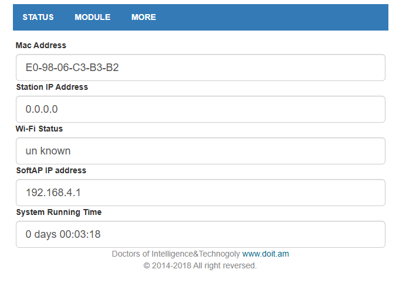
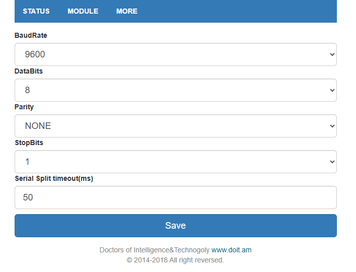
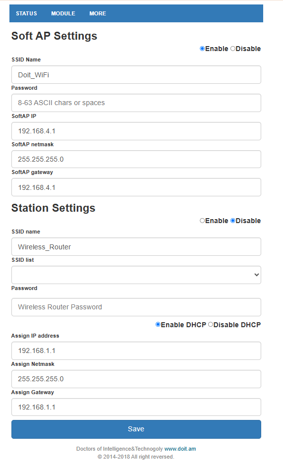
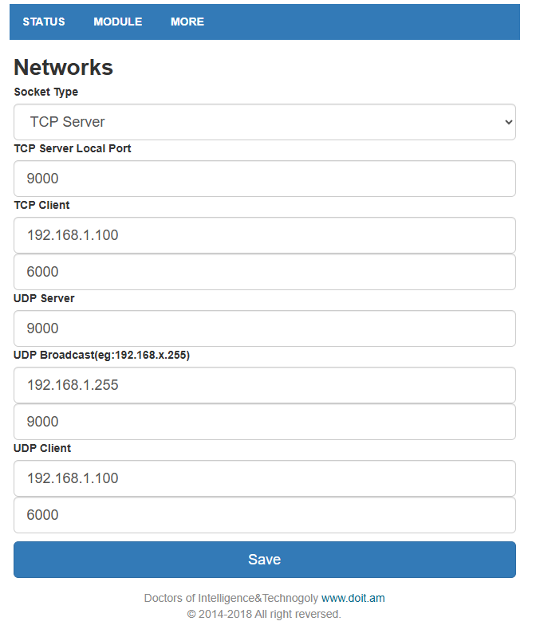
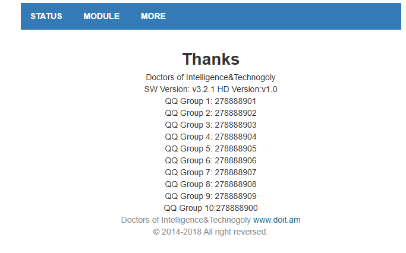

# DOIT V3-like Web UI module profile

This folder documents a second WiFi Serial Module variant that behaves much more like the documented DOIT transparent-transmission firmware than the previously characterized Espressif AT 1.1 module.

**Authenticity as an original DOIT-manufactured unit is not established**, but the firmware identity is now directly confirmed in the captured binary and the hardware has been independently identified through the ESP ROM bootloader.

## Verified hardware identity

The module is:

```text
ESP8285N08
26 MHz crystal
Embedded 1 MiB Flash
Flash manufacturer/device: 51 / 4014
MAC: e0:98:06:c3:b3:b2
Chip ID: 0x00c3b3b2
```

The ROM-reported MAC exactly matches the Web UI MAC.

See [`hardware-identification.md`](hardware-identification.md).

## Observed Web UI

The screenshots show a three-tab interface:

- `STATUS`
- `MODULE`
- `MORE`

The footer identifies:

```text
Doctors of Intelligence&Technology
www.doit.am
© 2014-2018 All right reversed.
```

The `MORE` page reports:

```text
SW Version: v3.2.1
HD Version: v1.0
```

### Status page



### UART settings



### Wi-Fi / AP / Station settings



### Network socket settings



### Firmware / hardware version page



## Current observed status

| Property | Observed value |
|---|---|
| MAC address shown by Web UI | `E0-98-06-C3-B3-B2` |
| Station IP | `0.0.0.0` |
| Wi-Fi Status | `un known` |
| SoftAP IP | `192.168.4.1` |
| SoftAP | enabled in captured configuration |
| SoftAP SSID | `Doit_WiFi` |
| SoftAP netmask | `255.255.255.0` |
| SoftAP gateway | `192.168.4.1` |
| Station | disabled in captured configuration |

## UART configuration shown

| Setting | Value |
|---|---|
| Baud rate | `9600` |
| Data bits | `8` |
| Parity | `NONE` |
| Stop bits | `1` |
| Serial split timeout | `50 ms` |

## Network modes exposed by the UI

The `Networks` page exposes at least:

- TCP Server
- TCP Client
- UDP Server
- UDP Broadcast
- UDP Client

The captured configuration shows:

```text
Socket Type: TCP Server
TCP Server Local Port: 9000
```

The server mode is observed working on this unit, which makes this firmware especially relevant to the project's direct wireless-UART pair topology.

## Firmware identity from the full Flash dump

A complete 1 MiB dump was captured and analyzed offline:

```text
SHA256: 81860AA052ECF5B888C6E128F2C4D15AC5DA1990DD69E45732F963B234EAB541
```

The binary contains direct identity markers including:

```text
Doit_Ser2Sock_3.2.1_20171229
Doit_WiFi_TTL_V2.0
SW Version: v3.2.1 HD Version:v1.0
AT+STASTATUS
AT+STAINFO
AT+TCPCLIENT
```

It also identifies its SDK lineage as ESP8266 **RTOS SDK 1.5.0-dev era**, not NONOS.

See [`flash-analysis.md`](flash-analysis.md).

## Relationship to the ESP8285N08 AT 1.1 specimen

Both characterized modules share:

```text
ESP8285N08
26 MHz crystal
Embedded 1 MiB Flash
Flash IDs 51 / 4014
DOUT image mode
40 MHz SPI Flash header frequency
```

The AT reference uses NONOS SDK 1.5.4 and its main flash-mapped application starts at `0x010000`.

The DOIT V3-like image uses an RTOS SDK 1.5.0-era application and its main flash-mapped region starts at `0x020000`.

This is strong evidence that the major functional difference is firmware/software architecture rather than a different ESP SoC or Flash class.

## Transplant research

A raw 1 MiB donor clone is deliberately rejected because the captured image contains donor-specific MAC, RF calibration and SDK/Wi-Fi state.

The repository now includes a read-only/offline candidate builder:

[`tools/build_doit_transplant_image.py`](../../tools/build_doit_transplant_image.py)

For the characterized target ESP8285N08 (`MAC 7c:87:ce:9f:7c:3c`, chip ID `0x009f7c3c`), the sanitized candidate can be built reproducibly with expected SHA-256:

```text
C1090E484F2EF71630E67B269868320D50095236D8892540A53B17847326FE56
```

The candidate has **not yet been boot-tested on the target**.

See [`transplant-plan.md`](transplant-plan.md) for the reversible write, first-boot, post-boot-capture and rollback procedure.

## Project significance

The intended topology remains:

```text
Device A UART
    |
DOIT-like module A
AP + TCP Server
    |
    | Wi-Fi
    |
DOIT-like module B
STA + TCP Client
    |
Device B UART
```

If the controlled transplant succeeds, the already-owned ESP8285N08 AT modules may be convertible to the more useful DOIT-style TCP Server/Client firmware behavior without changing the underlying SoC/Flash hardware class.

## Images

The captured Web-interface screenshots are stored in [`img/`](img/):

- [`status.png`](img/status.png)
- [`uart-settings.png`](img/uart-settings.png)
- [`wifi-settings.png`](img/wifi-settings.png)
- [`network-settings.png`](img/network-settings.png)
- [`about.png`](img/about.png)

See [`img/README.md`](img/README.md) for the naming scheme.

## Capture procedure

Commands for reproducing the hardware identification, Flash backup, hashes and scanner reports are in:

[`capture/README.md`](capture/README.md)
